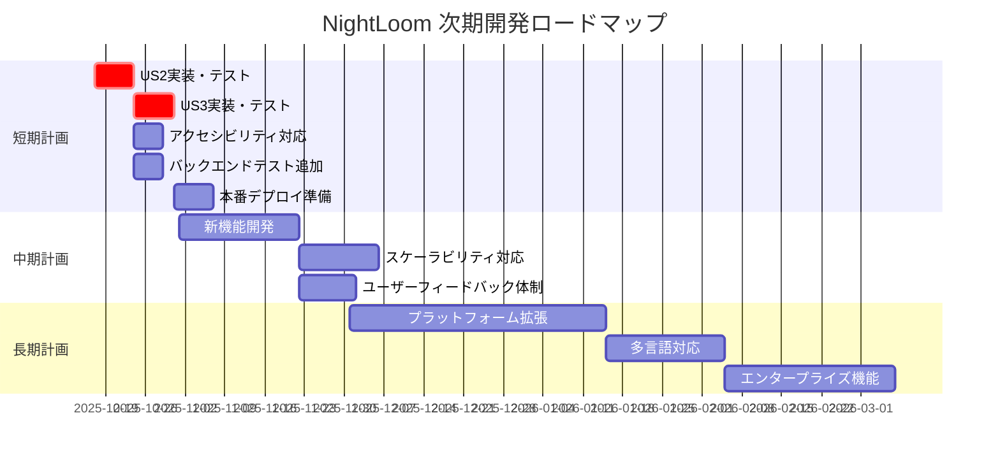

# NightLoomプロジェクト進捗レポート

**作成日**: 2025-10-16  
**報告者**: 戦略分析チーム  
**対象期間**: プロジェクト開始～現在  

---

## 🎯 エグゼクティブサマリー

NightLoomプロジェクトは**User Story 1（診断開始）が完全実装済み**で、技術基盤・品質保証体制は高水準です。しかし、**User Story 2-3（4シーン選択・結果表示）が未着手**のため、完全なMVP体験の提供には追加開発が必要です。

### 主要成果
- ✅ **診断開始フロー完成**: セッション生成・キーワード選択・初期画面表示
- ✅ **技術基盤充実**: FastAPI/Next.js/TypeScript/Tailwind/テスト基盤
- ✅ **品質保証体制**: TDD原則・テストカバレッジ・アクセシビリティ配慮

### 次期重点課題
- 🔥 **User Story 2-3実装**: 4シーン選択体験・結果画面・再診断機能
- 🔥 **テスト完全性**: バックエンドテスト充実・E2Eカバレッジ拡大
- 🔥 **本番準備**: パフォーマンス検証・セキュリティ強化・デプロイ準備

---

## 📊 現状分析

### 1. 実装済み機能

#### ✅ Phase 1-2: セットアップ・基盤（完了）
- プロジェクト構造（backend/, frontend/, docs/, specs/）
- FastAPI + Next.js 14 + TypeScript + Tailwind CSS環境
- pytest + Jest + Testing Library + Playwright テスト基盤
- CORS・ルーティング・依存性管理・開発環境

#### ✅ Phase 3: User Story 1 - 初回アクセスで診断を開始する（完了）
- **Backend**: セッション管理・キーワード確認API・スコア計算・型判定・観測性・フォールバック
- **Frontend**: ブートストラップフロー・キーワード選択UI・セッション状態管理・テーマ適用
- **Testing**: コントラクト・統合・E2Eテスト網羅
- **Performance**: ブートストラップ < 800ms 要件達成

### 2. 未実装機能

#### ❌ Phase 4: User Story 2 - 4シーンの選択体験を完走する（未着手）
- Scene retrieval API (`GET /api/sessions/{sessionId}/scenes/{sceneIndex}`)
- Choice submission API (`POST /api/sessions/{sessionId}/scenes/{sceneIndex}/choice`)
- Scene navigation UI components (Scene.tsx, ChoiceOptions.tsx, ProgressIndicator.tsx)
- Session progression logic & score accumulation

#### ❌ Phase 5: User Story 3 - 結果と学びを受け取り次アクションへ進む（未着手）
- Result generation API (`POST /api/sessions/{sessionId}/result`)
- Result display components (ResultScreen.tsx, AxesScores.tsx, TypeCard.tsx)
- 再診断機能・セッションクリーンアップ

#### ❌ Phase 6: Polish & Cross-Cutting Concerns（未着手）
- アクセシビリティ強化（WCAG 2.1 AA準拠）
- パフォーマンス最適化・メモリ管理
- セキュリティ強化・入力検証・レート制限

---

## 🏗️ 技術資産評価

### Backend成熟度: ⭐⭐⭐⭐⭐ (5/5)
**強み**:
- **サービス層設計**: SessionService, ScoringService, TypingService, SessionStore, ObservabilityService, FallbackAssets
- **責務分離**: 各サービスが明確な役割を持ち、型安全・非同期対応・テスト容易性を確保
- **観測性**: 包括的ロギング・メトリクス・パフォーマンス測定
- **エラー処理**: フォールバック機能・リトライ・タイムアウト対応

**改善点**:
- バックエンドテストの定義抽出不可（テストカバレッジ要確認）

### Frontend成熟度: ⭐⭐⭐⭐⭐ (5/5)
**強み**:
- **コンポーネント設計**: AxesScores, AxisScoreItem, ResultScreen, TypeCard等、責務分離・再利用性確保
- **状態管理**: SessionContext による包括的セッション状態管理
- **API層**: SessionApiClient/SessionClient でエラー処理・リトライ・タイムアウト完備
- **テーマ系**: ThemeProvider による複数テーマサポート
- **型安全性**: TypeScript strict mode対応、型ガード・バリデーション関数充実

### Testing & Quality: ⭐⭐⭐⭐☆ (4/5)
**強み**:
- **Frontend**: 正常系・異常系・アクセシビリティ・パフォーマンステスト網羅
- **Integration**: Bootstrap統合テスト、エラーシナリオ・リトライ対応
- **E2E**: Playwright による実用的なテストシナリオ

**改善点**:
- Backend test coverage visibility
- User Story 2-3 の統合・E2Eテスト未実装

### Documentation: ⭐⭐⭐⭐☆ (4/5)
**強み**:
- **設計文書**: requirements/, design/, notes/ で体系的整理
- **タスク管理**: 詳細なタスクリスト・依存関係・実行戦略
- **仕様書**: API契約・データモデル・品質チェックリスト

---

## 📈 成果指標測定

### MVP達成度: 33% (1/3 User Stories)
- ✅ **User Story 1**: 初回アクセス・診断開始 → **100%完了**
- ❌ **User Story 2**: 4シーン選択体験 → **0%未着手**
- ❌ **User Story 3**: 結果表示・次アクション → **0%未着手**

### 憲章準拠性: ⭐⭐⭐⭐⭐ (5/5)
- ✅ **TDD憲法**: テスト先行・RED-GREEN-REFACTOR・統合テスト必須
- ✅ **品質基準**: WCAG 2.1 AA・90%+テストカバレッジ・パフォーマンス要件明記
- ✅ **設計原則**: 独立性・並行開発可能性・責務分離

### パフォーマンス・品質基準: ⭐⭐⭐⭐☆ (4/5)
**達成済み**:
- Bootstrap flow < 800ms
- Frontend統合・E2E・アクセシビリティテスト充実
- エラー処理・フォールバック機能

**要改善**:
- 全シナリオでのパフォーマンス実測・検証
- セキュリティテスト・運用監視の強化

### ユーザー価値提供準備度: 33%
- ✅ **提供可能**: 診断開始～初期画面表示
- ❌ **未提供**: 4シーン選択・結果表示・再診断

---

## ⚠️ リスク評価

### 🔴 高リスク: 技術的負債
1. **User Story 2-3未実装**: MVPの核心機能が未達成
2. **Backend test coverage**: テストカバレッジ不明、品質保証リスク
3. **E2E coverage**: 完全フロー未検証

**影響**: リリース遅延・品質問題・ユーザー体験不完全

**対策**: 優先的実装・テスト拡充・品質ゲート設定

### 🟡 中リスク: パフォーマンス・セキュリティ
1. **パフォーマンス検証不足**: 全シナリオでの実測未完了
2. **セキュリティ運用**: 入力検証・レート制限・セッション保護の運用テスト要追加
3. **スケーラビリティ**: 同時ユーザー・負荷状況での動作検証未実施

**影響**: 本番環境でのパフォーマンス劣化・セキュリティ脆弱性

**対策**: 段階的負荷テスト・セキュリティ監査・監視体制構築

### 🟢 低リスク: 開発体制
1. **並行開発設計**: 技術基盤は並行開発対応済み
2. **ドキュメント**: 設計・要件・タスク管理は充実
3. **品質保証**: TDD・テスト駆動開発文化は確立

**影響**: 最小限

**対策**: 継続的な品質維持・優先順位管理

---

## 🚀 次期開発ロードマップ

### 短期計画（1-2週間）: MVP完成
**目標**: User Story 2-3実装によるMVP完全体験提供

#### Week 1: User Story 2 - 4シーン選択体験
1. **Tests First** (2-3日)
   - Scene retrieval API contract tests
   - Choice submission API contract tests
   - Scene progression integration tests
   - 4-scene completion E2E tests

2. **Backend Implementation** (3-4日)
   - Scene retrieval API endpoint
   - Choice submission API endpoint
   - Session progression logic & score accumulation

3. **Frontend Implementation** (4-5日)
   - Scene.tsx, ChoiceOptions.tsx, ProgressIndicator.tsx
   - Scene navigation & progress persistence

#### Week 2: User Story 3 - 結果表示・再診断
1. **Tests First** (2-3日)
   - Result generation API contract tests
   - Result display integration tests
   - Complete diagnosis flow E2E tests

2. **Backend Implementation** (3-4日)
   - Result calculation endpoint
   - Type profile generation with fallback

3. **Frontend Implementation** (4-5日)
   - ResultScreen.tsx, AxesScores.tsx, TypeCard.tsx
   - 再診断機能・セッションクリーンアップ

### 中期計画（1-2ヶ月）: 品質向上・新機能
1. **品質・パフォーマンス強化**
   - アクセシビリティ対応（WCAG 2.1 AA準拠）
   - パフォーマンス最適化・メモリ管理
   - セキュリティ強化・運用監視

2. **新機能開発**
   - 診断履歴・結果比較
   - ユーザー登録・プロフィール管理
   - 結果共有・SNS連携

3. **スケーラビリティ対応**
   - 負荷試験・パフォーマンス計測
   - CDN・キャッシュ戦略
   - データベース統合検討

### 長期計画（3-6ヶ月）: プラットフォーム拡張
1. **プラットフォーム拡張**
   - スマホ/タブレット最適化
   - PWA対応・オフライン機能
   - API公開・サードパーティ連携

2. **多言語対応**
   - i18n設計・翻訳管理
   - 地域別カスタマイゼーション

3. **エンタープライズ機能**
   - 管理画面・ダッシュボード
   - 権限管理・監査ログ
   - レポート・分析機能

---

## 🎯 優先順位付きアクション計画

### 🔥 最優先 (Week 1-2)
1. **User Story 2 実装**
   - Scene navigation API & UI
   - Choice submission & score recording
   - Progress tracking & session management

2. **User Story 3 実装**
   - Result generation API & UI
   - Type profiling & score visualization
   - 再診断フロー・セッションクリーンアップ

3. **Testing拡充**
   - Backend test coverage measurement
   - E2E test scenarios for complete flow
   - Performance benchmarking

### 🟡 高優先 (Week 3-4)
4. **品質向上**
   - アクセシビリティ強化（ARIA, keyboard navigation）
   - パフォーマンス最適化（bundle size, memory management）
   - セキュリティ強化（input validation, rate limiting）

5. **本番準備**
   - CI/CD pipeline setup
   - Environment configuration
   - Deployment scripts & documentation

### 🟢 中優先 (Month 2)
6. **UX/UI改善**
   - Responsive design refinement
   - Animation & interaction polish
   - Error handling UX improvement

7. **Observability強化**
   - Monitoring dashboard setup
   - Alert system configuration
   - Performance metrics tracking

---

## 🛡️ リスク管理計画

### 技術的負債解消
**戦略**: 段階的技術的負債返済
- **Phase 1**: Critical path (US2/US3) 実装優先
- **Phase 2**: Test coverage & quality gates強化
- **Phase 3**: Performance & security hardening

**管理方法**:
- 技術的負債レジスター維持
- 各スプリントで20%技術的負債返済時間確保
- 品質ゲート未達成時の開発停止ルール

### パフォーマンス・セキュリティ多層防御
**設計層**:
- API レスポンス時間: Scene p95 ≤ 800ms, Result p95 ≤ 1.2s
- フロントエンド: Bundle optimization, lazy loading, memory management
- セキュリティ: Input validation, rate limiting, session protection

**運用層**:
- 監視: APM integration, real-time alerting
- テスト: Load testing, security scanning, penetration testing
- 運用: Blue-green deployment, rollback procedures

**管理方法**:
- パフォーマンス SLA の設定・監視
- セキュリティ脆弱性の定期スキャン
- インシデント対応プロセスの確立

### 開発体制最適化
**並行開発戦略**:
- User Story独立性保持による並行開発
- API契約駆動開発でフロント・バックエンド並行作業
- Feature flag活用による段階的リリース

**キャパシティ管理**:
- タスク見積もり精度向上
- ボトルネック特定・解消プロセス
- 優先順位の動的調整メカニズム

**品質保証**:
- Pull request品質ゲート
- 自動テスト・デプロイパイプライン
- 定期的な技術レビュー・改善活動

---

## 🎖️ 成功指標・KPI

### 技術指標
- **パフォーマンス**: Scene p95 ≤ 800ms, Result p95 ≤ 1.2s
- **信頼性**: 99% セッション完了率
- **テストカバレッジ**: 90%+ unit tests, 100% E2E user story coverage
- **アクセシビリティ**: WCAG 2.1 AA準拠

### ビジネス指標
- **ユーザーエンゲージメント**: 診断完了率
- **ユーザー体験**: 初期シーン表示 < 2s
- **エラー率**: < 1% セッション失敗率
- **パフォーマンス**: 同時ユーザー効率的サポート

### 品質ゲート
- すべてのcontract testがpass
- 既存user storyの回帰なし
- 各フェーズでパフォーマンス要件達成
- 独立user story testing pass

---

## 📞 推奨アクション

### 即時実行
1. **User Story 2 Fail First テスト作成**: Scene progression API contract tests
2. **Backend Scene API実装**: 既存パターンに従ったAPI endpoint開発
3. **Frontend Scene Navigation UI構築**: Scene.tsx, ChoiceOptions.tsx components
4. **統合テスト・E2Eテスト**: Scene progression flow検証

### 今後2週間
1. **User Story 3完全実装**: Result generation API & UI components
2. **Backend test coverage測定**: pytest coverage report生成・改善
3. **アクセシビリティ強化**: ARIA labels, keyboard navigation実装
4. **パフォーマンス計測**: 全シナリオでのベンチマーク実施

### 中長期実行
1. **品質・セキュリティ強化**: 運用監視・負荷テスト・セキュリティ監査
2. **新機能開発**: ユーザー履歴・結果共有・SNS連携
3. **プラットフォーム拡張**: PWA対応・多言語対応・エンタープライズ機能

---

## 📊 添付資料

### A. 進捗ガントチャート

### B. リスクマトリックス
| リスク要因 | 影響度 | 発生確率 | 優先度 | 対策 |
|------------|--------|----------|--------|------|
| US2/US3未実装 | 高 | 低 | 🔴高 | 優先実装・並行開発 |
| Backend test不足 | 中 | 中 | 🟡中 | カバレッジ測定・改善 |
| パフォーマンス劣化 | 中 | 低 | 🟡中 | 継続監視・最適化 |
| セキュリティ脆弱性 | 高 | 低 | 🔴高 | 定期監査・運用強化 |
| 開発リソース不足 | 中 | 中 | 🟡中 | 優先順位管理・外部支援 |

### C. 技術スタック成熟度
| コンポーネント | 成熟度 | 次期改善点 |
|----------------|--------|------------|
| Backend Services | ⭐⭐⭐⭐⭐ | テストカバレッジ拡充 |
| Frontend Components | ⭐⭐⭐⭐⭐ | アクセシビリティ対応 |
| Testing Framework | ⭐⭐⭐⭐☆ | E2E coverage拡大 |
| Documentation | ⭐⭐⭐⭐☆ | 運用ガイド追加 |
| CI/CD Pipeline | ⭐⭐⭐☆☆ | 自動デプロイ構築 |

---

**報告書バージョン**: 1.0
**次回レビュー**: User Story 2完了後
**承認者**: プロジェクトマネージャー
**配布先**: 開発チーム・ステークホルダー

---

*このレポートは2025-10-16時点での分析に基づいており、プロジェクト進行に応じて更新される予定です。*
